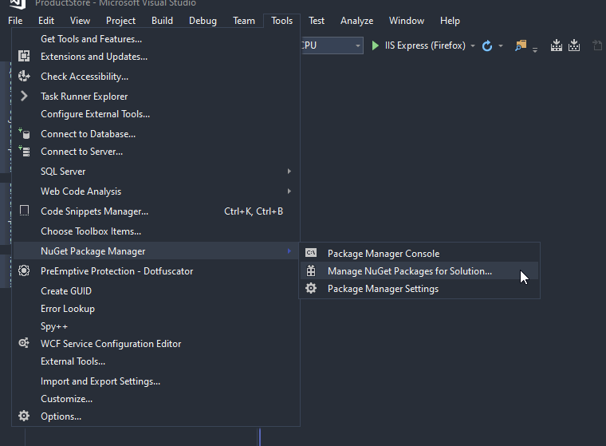
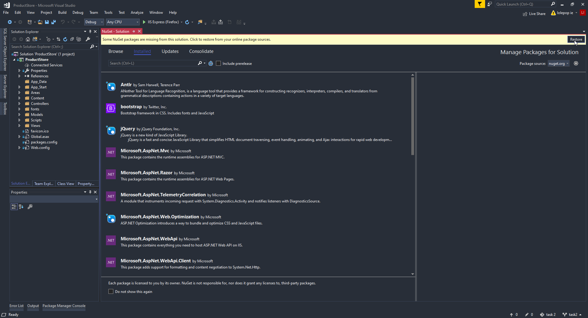

# CSC Assignment

# Required steps to setup on all projects

Once Visual Studio is open, navigate to `Tools > NuGet Package Manager > Manage NuGet Packages for Solution`

Click restore on the banner to restore missing nuget packages for the project

Upon running and there is an error about `csc.exe`, clean project (rebuilding alone does not work) then build and run again
