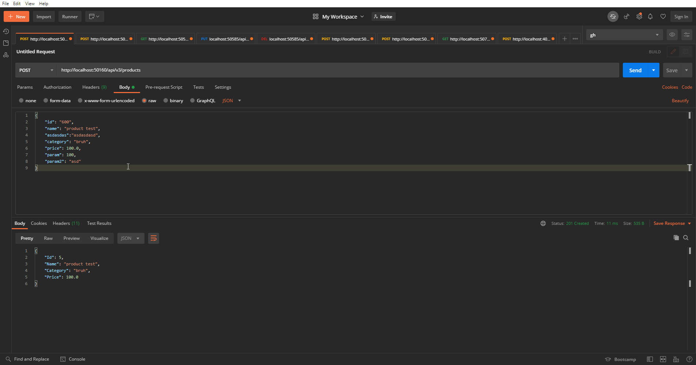
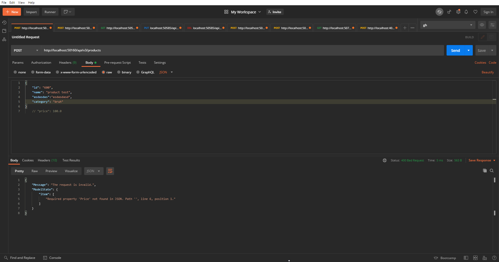

# Setup

## Projects
CRUD project: `ProductStore`

Over/under posting project: `Practical3`

# CRUD API

## Get a list of all products
`GET` /api/v2/products

### Response

```json
[
    {
        "Id": int,
        "Name": string,
        "Category": string,
        "Price": decimal
    },
    ...
]
```

## Get a product by ID
`GET` /api/v2/products/:id

### Response

```json
{
    "Id": int,
    "Name": string,
    "Category": string,
    "Price": decimal
}
```

## Get a product by category
`GET` /api/v2/products?category=category

### Response

```json
[
    {
        "Id": int,
        "Name": string,
        "Category": string,
        "Price": decimal
    },
    ...
]
```


## Create a new product
`POST` /api/v2/products

### Request

```json
{
    "Name": string,
    "Category": string,
    "Price": decimal
}
```

### Response

```json
{
    "Id": int,
    "Name": string,
    "Category": string,
    "Price": decimal
}
```


## Update a product
`PUT` /api/v2/products/:id

### Request

```json
{
    "Name": string,
    "Category": string,
    "Price": decimal
}
```

### Response

204 No Content


## Delete a product
`DELETE` /api/v2/products/:id

### Response

204 No Content


# Over/under posting API

## Create a new product
`POST` /api/v3/products

### Request

```json
{
    "Name": string,
    "Category": string,
    "Price": decimal
}
```

### Response

```json
{
    "Id": int,
    "Name": string,
    "Category": string,
    "Price": decimal
}
```

If input is invalid:

```json
{
    "Message": string,
    "ModelState": Object (depending on error)
}
```

# Screenshots

## CRUD

### Create Product


### Update Product


### Delete Product


### Get List of All Products


### Get Product by ID


### Get Product by Category


## Over/under posting

### Overposting


### Underposting

