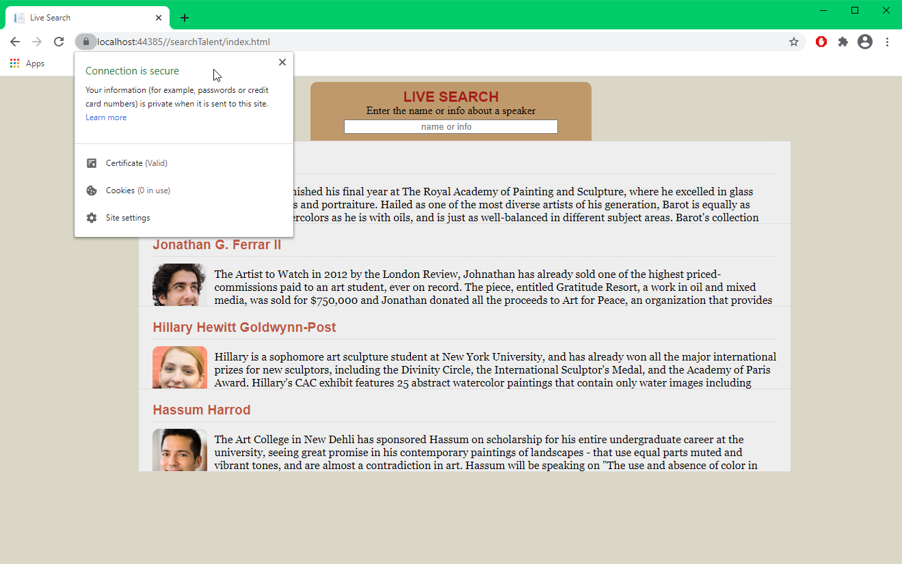
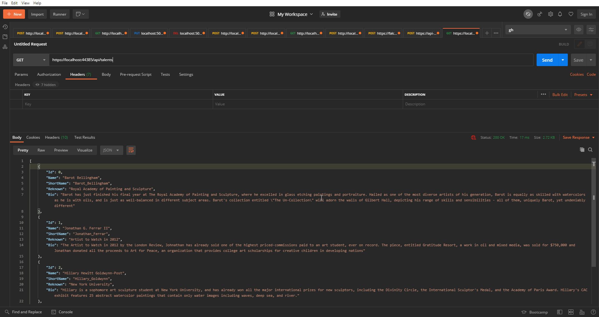

# Setup

## HTTPS
1. Click on the `TalentSearch` project from `Solution Explorer`
2. In the `Properties` section, use the url under `SSL URL` to access the page with HTTPS enabled

# Sequence Diagram


# API

## Get All Talents
`GET` /api/Talents

### Response

```json
[
    {
        "Id": int,
        "Name": string,
        "ShortName": string,
        "Reknown": string,
        "Bio": string
    },
    ...
]
```

# Screenshots

## HTTPS


## Get All Talents Response


## Search with spinner

