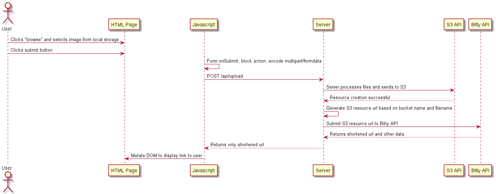

# Setup

## AWS Credentials
1. Login to aws educate account
2. Once on the Vocareum dashboard, click on `Account Details`


3. Click on show and copy contents into ~/.aws/credentials (%UserProfile%/.aws/credentials)

4. Add the following line into the credentials file: `region=us-east-1`. Place this under the [default] config key


## AWS S3 Setup
1. Click `AWS Console` and navigate over to `S3`
2. Create a new bucket in `us-east-1`
3. Turn off `Block all public access` and create the bucket
4. Click on the newly create bucket, go to `Permissions` and scroll down to `Bucket policy` and edit it to:

```JSON
{
    "Version": "2008-10-17",
    "Statement": [
        {
            "Sid": "AllowPublicRead",
            "Effect": "Allow",
            "Principal": {
                "AWS": "*"
            },
            "Action": "s3:GetObject",
            "Resource": "YOUR BUCKET ARN HERE/*"
        }
    ]
}
```


## Bitly API Key

1. Register/login for [Bitly](https://app.bitly.com)

2. Click `Profile Settings > Generic Access Token`. Follow the instructions there and create a access token


## Project Configuration

In `solution/task5/task5/` create a file `.env` with keys:
```
BITLY_TOKEN=YOUR_BITLY_TOKEN
AWS_BUCKET=YOUR_AWS_BUCKET_NAME
```

# Usage
Navigate to /Uploader/Index, select image and upload it. A download link should appear above the form, errors will be shown in an alert box.

# Sequence Diagram


# API

## Upload Image to S3 and Shorten
`POST` /api/Upload

### Request
Accepts multipart/form-data with a single file

### Response
A single string that is a bitly shortened url pointing to the uploaded resource in s3.

Example:
```
https://bit.ly/...
```

# Additional features

## Verify file is an image and is a reasonable size (server)


## Validate file is an image (client)


