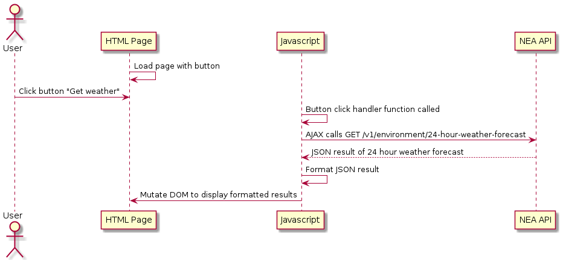
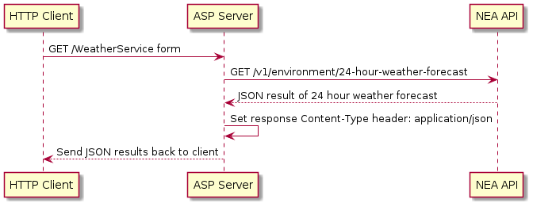

# Setup

## Projects
Client: client/index.html\
Server: WeatherServiceForm.aspx

# Sequence Diagram

## Client

## Server

# API
The [NEA weather API](https://data.gov.sg/dataset/weather-forecast?resource_id=9a8bd97e-0e38-46b7-bc39-9a2cb4a53a62)
