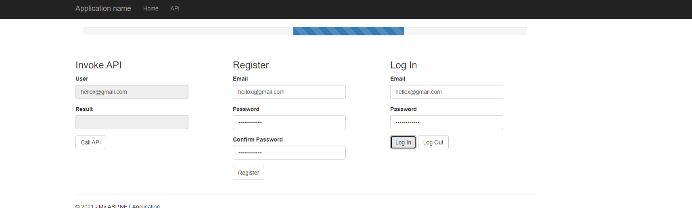
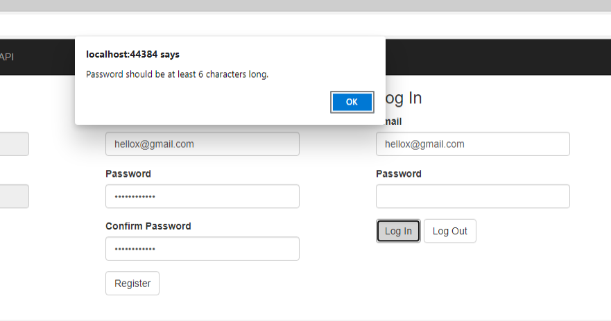
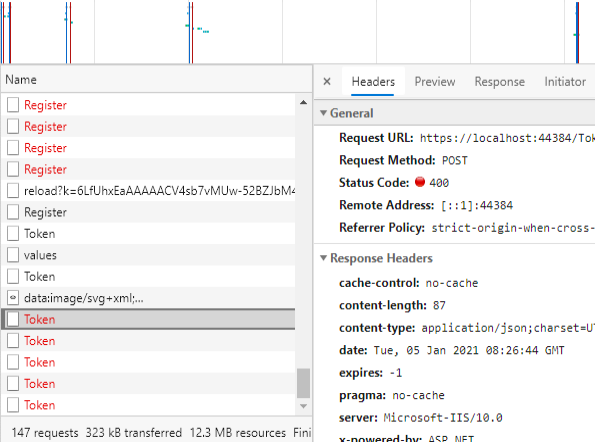
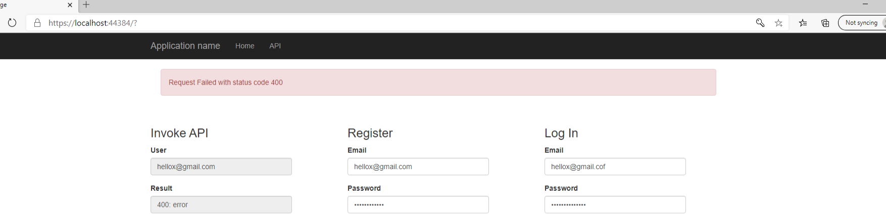
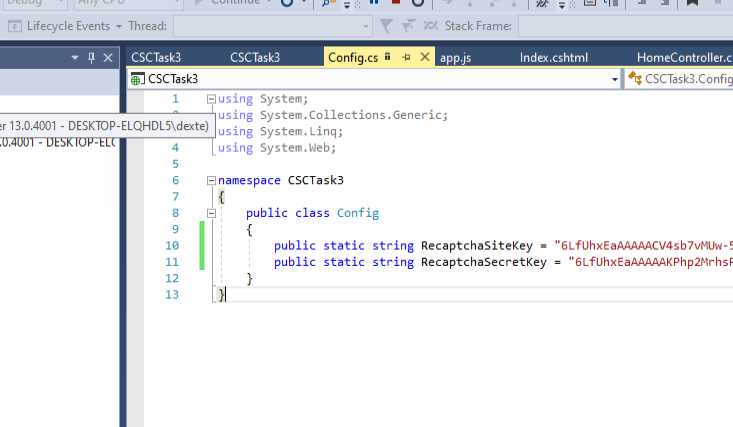

# Task 3

## Web API document and Postman testing result

Refer to `task3-documents.pdf`.

## Understanding, efficiency, robustness and security of the code

Loading bar is shown during login/register/invoke api API request:

Client side email and password validation for login and register:

Retry logic for login, register, and invoke api:

API failure alert after multiple retries:

## Set up Guide

### 1. Recaptcha

Create a site on Recaptcha (https://www.google.com/recaptcha/).

Configure the recaptcha settings for the site to:

1. allow domains localhost and 127.0.0.1
2. Verify the origin of recaptcha solutions

https://www.google.com/recaptcha/admin/site/{id}/settings

Copy the Site key and Secret Key

### 2. Configure credentials in project

Open the project. 

Open Config.cs and fill in the site and secret key:

### 3. Start the project

Click on the CSCTask3 in the Solution Explorer. You should see the SSL Url in the Properties table:

Use this HTTPS URL to access the application instead of the HTTP one.

You can now start the project and navigate to the SSL URL:

