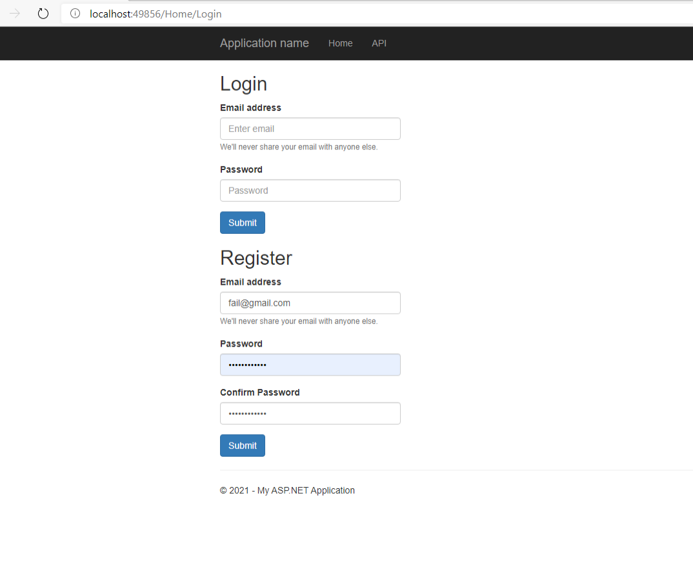
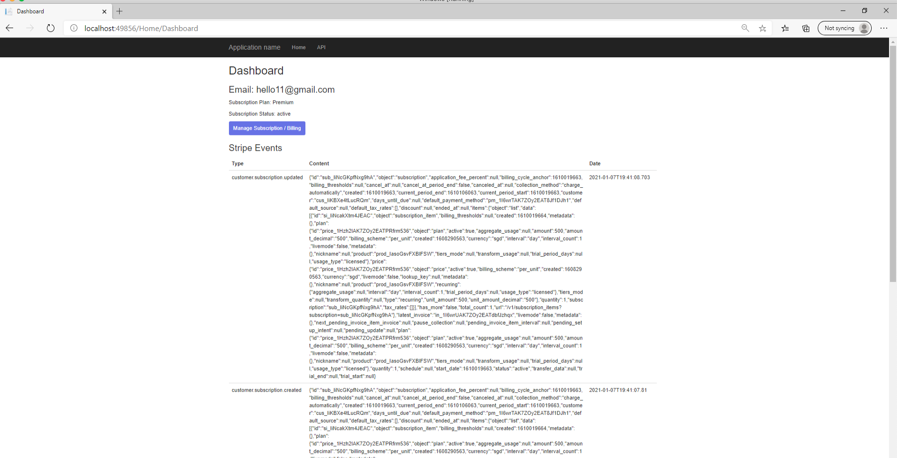
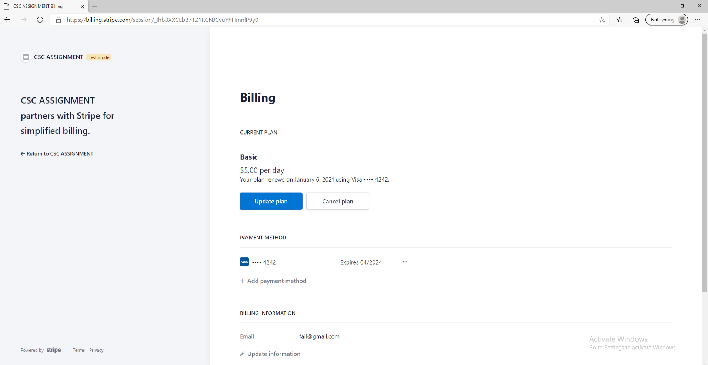

# CSC Task 6

## Sequence Diagrams

There are two sequence diagrams, `sequence-diagram.png` and `sequence-diagram-webhook.png`.

## Usage and Testing



Head over to /Home/Login/ to register then login. You should then be redirected to /Home/Dashboard/

If you have no existing subscription, you should see a plans page:


Clicking the checkout button will direct you to a Stripe Checkout page:


Note that you can use `4242 4242 4242 4242` as a test card when checking out or managing subscriptions.

After checkout is completed, you will be redirected back to the dashboard, which will now show the subscription plan, status, manage billing button, and a list of stripe charge and subscribe events.



Clicking the manage billing button will direct you to the self serve customer portal, which can be used to:

1. Upgrade Plan
2. Cancel Plan
3. Update payment information



To test failed recurring charges, you can update the payment information to use the card `4000 0000 0000 0341`. See the Stripe documentation for the full list of cards used to test for specific errors: https://stripe.com/docs/testing#cards-responses.

## Understanding, efficiency, robustness and security of the code

Loading bar is shown for login/register/generate a stripe checkout / self-serve portal session:


The following APIs will retry up-to five times when they fail:
1. Login
2. Register
3. Generate Checkout Session (Basic + Premium)
4. Generate Self-Serve Portal Session.


## Set Up Guide

### 1. Create Products and Pricing

On the Products Page (https://dashboard.stripe.com/test/products), create two Products:

- Basic Plan
  - Price of $5/day
- Premium Plan
  - Price of $15/day

End Result:


Hold on to the pricing ID for both products, they will be used to configure the project:


### 2. Configure Billing Portal

Billing Settings Page: https://dashboard.stripe.com/test/settings/billing/portal

Enable the following options:

1. Payment methods: Allow customers to update their payment methods
2. Cancel subscriptions
3. Update subscriptions


Add the two products to the portal:


Fill in the links with the appropriate fields. Since we are running it locally it can be a random URL:


Save Changes.

### 3. Configure and Start Project

Open the Project with Visual Studio and open Config.cs:


Fill in all the credentials except for `StripeWebhookSecretKey`.

Take note of the localhost port. In our case it is `49856`:


### 4. Forward Webhook Events to localhost

From: https://stripe.com/docs/webhooks/test

Install the Stripe CLI. See https://stripe.com/docs/webhooks/test

Run the following command to forward webhook events to the server:

```
stripe listen --forward-to localhost:49856/api/Stripe/Webhook
```

You should see the webhook secret printed in the terminal:


Add the secret to Config.cs and restart the project.

The server should now receive webhook events.