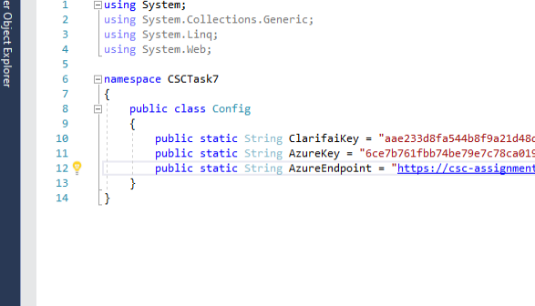

# Task 7

## Set up Guide

This project relies on Clarifai to identify image concepts and Azure Cognitive Services to extract receipt values.

Add the relevant credentials to Config.cs before starting the project:

You can create a Clarifai account to create a Clarifai application to get the Clarifai API key here: https://www.clarifai.com/

You can create a free Azure Cognitive Service subscription to get the key and endpoint
https://azure.microsoft.com/en-us/services/cognitive-services/
