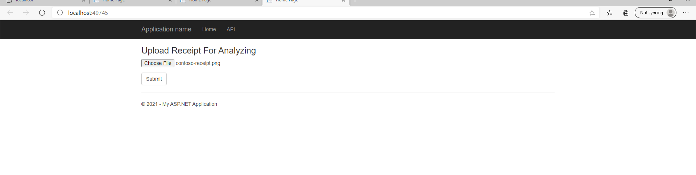
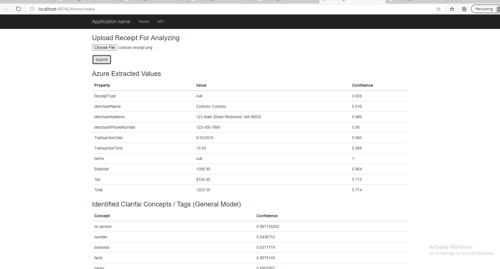
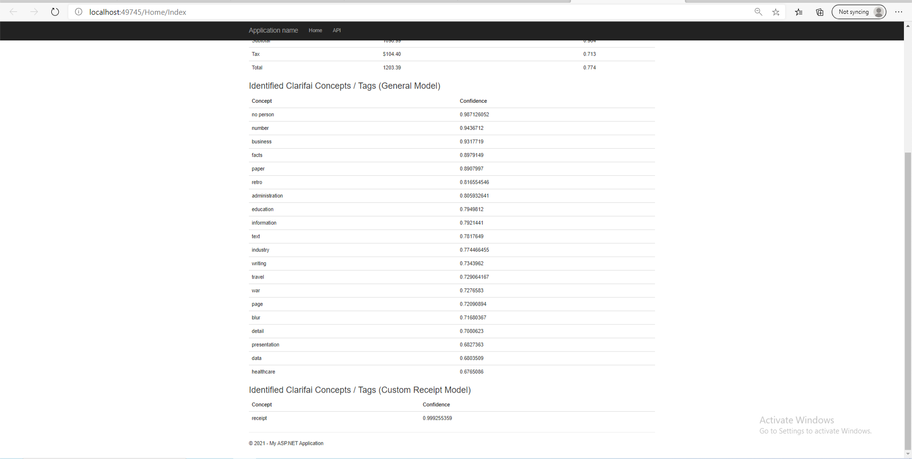
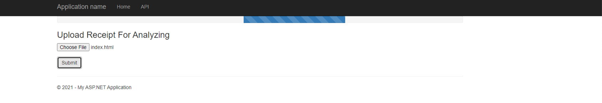
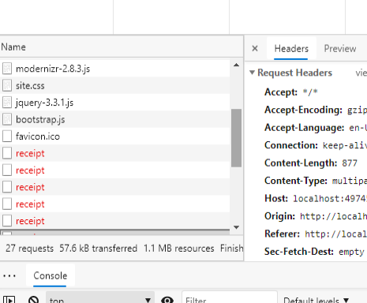
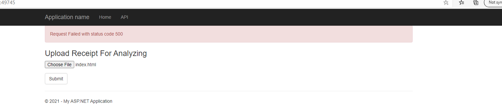
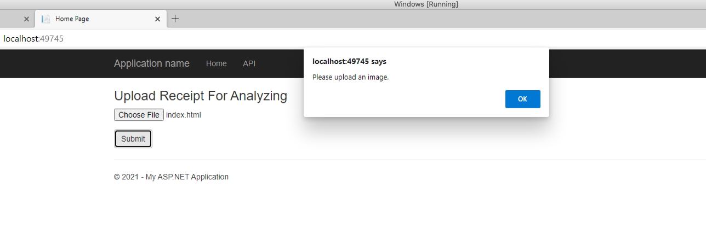
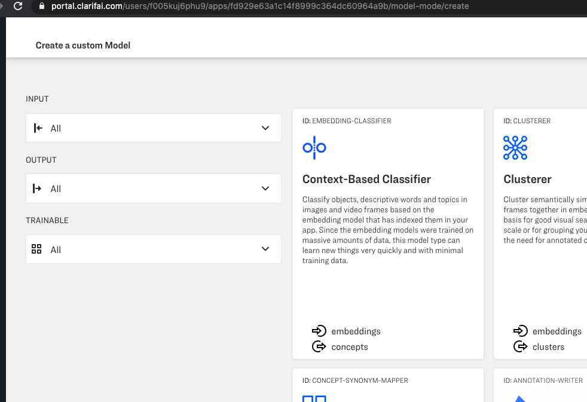
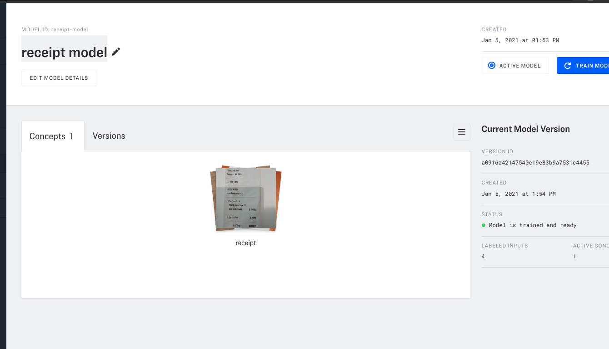

# Task 7

## Sequence Diagram

Refer to `sequence-diagram.png`.

## Usage

1. Upload an image

2. Click on Submit and wait for it to complete

3. View the results

## Understanding, efficiency, robustness and security of the code

A loading bar is displayed after the image is uploaded while the image is being processed by the server.

The AJAX request made when the user clicks on submit will retry at most five times if the status code is 4xx or 5xx.

A failure alert is shown if the form submit request fails after multiple retries

There is client side validation to check that the file is an image before submitting.

## Set up Guide

This project relies on Clarifai to identify image concepts and Azure Cognitive Services to extract receipt values.

Add the relevant credentials to Config.cs before starting the project:

You can create a Clarifai account to create a Clarifai application to get the Clarifai API key here: https://www.clarifai.com/

For the `ClarifaiReceiptModelId` variable, you will need to fill in a custom model id used to identify whether an image is a receipt or not.

Create a custom Clarifai model (Context-Based Classifier):

There should be only one concept under the custom model - receipt.

Train the custom model by adding positive and negative receipt images.

You can create a free Azure Cognitive Service subscription to get the key and endpoint
https://azure.microsoft.com/en-us/services/cognitive-services/